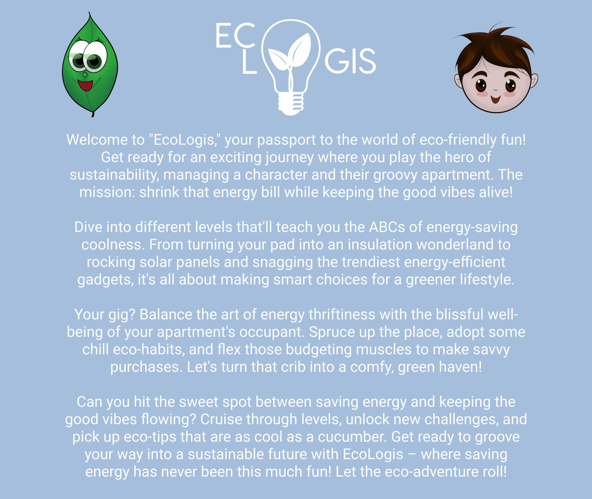
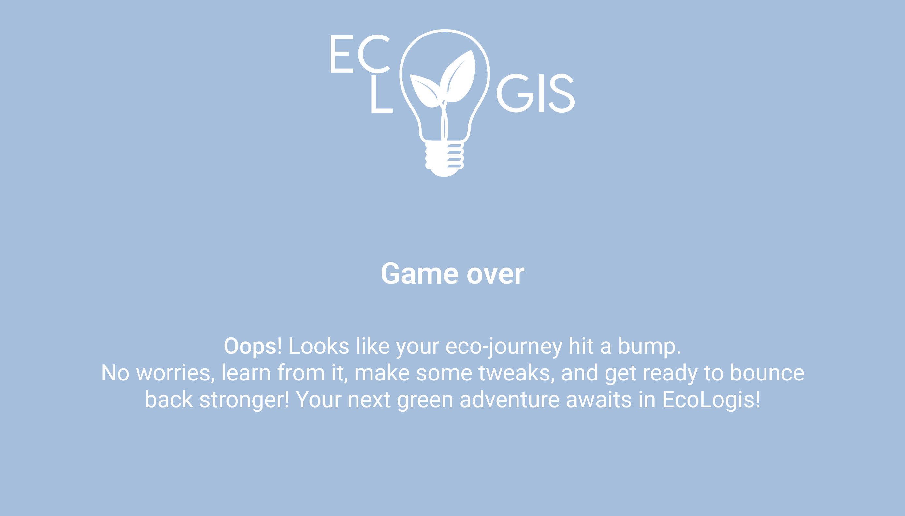

# EcoLogis

## Introduction

### Text
Welcome to "EcoLogis," your passport to the world of eco-friendly fun! Get ready for an exciting journey where you play the hero of sustainability, managing a character and their groovy apartment. The mission: shrink that energy bill while keeping the good vibes alive!

Dive into different levels that'll teach you the ABCs of energy-saving coolness. From turning your pad into an insulation wonderland to rocking solar panels and snagging the trendiest energy-efficient gadgets, it's all about making smart choices for a greener lifestyle.

Your gig? Balance the art of energy thriftiness with the blissful well-being of your apartment's occupant. Spruce up the place, adopt some chill eco-habits, and flex those budgeting muscles to make savvy purchases. Let's turn that crib into a comfy, green haven!

Can you hit the sweet spot between saving energy and keeping the good vibes flowing? Cruise through levels, unlock new challenges, and pick up eco-tips that are as cool as a cucumber. Get ready to groove your way into a sustainable future with EcoLogis – where saving energy has never been this much fun! Let the eco-adventure roll!

### Image

### Sound
<audio src="sounds/game-music-loop-7.mp3" controls title="game-music"></audio>

## Menu

### Image
Add to background :

### Sound

- **Background** : same as introduction
- **Clicks** : <audio src="sounds/select-sound.mp3" controls title="game-music"></audio>

## Game

### Image
Use 

and

### Sound

- **Background** : <audio src="sounds/juggling-andrey-rossi-main-version.mp3" controls title="game-music"></audio>
- **Room changes** : <audio src="sounds/open-and-closed-door.mp3" controls title="game-music"></audio>
- **Main char footsteps** : <audio src="sounds/indoor-footsteps.mp3" controls title="game-music"></audio>
- **Child caught** : <audio src="sounds/surprised-child-voice-sound.mp3" controls title="game-music"></audio>
- **Child footsteps** : <audio src="sounds/running-1.mp3" controls title="game-music"></audio>
- **Object upgraded** : <audio src="sounds/correct.mp3" controls title="game-music"></audio>
- **Object interaction** : <audio src="sounds/button.mp3" controls title="game-music"></audio>

### Texts

#### Game over
Oops! Looks like your eco-journey hit a bump. No worries, learn from it, make some tweaks, and get ready to bounce back stronger! Your next green adventure awaits in EcoLogis!

#### Next level
Congratulations! You've mastered the art of eco-living! Level up in EcoLogis and continue your journey towards a greener, more sustainable future. Get ready for new challenges and even cooler ways to make a positive impact on your virtual world!

#### Winning
You did it! EcoLogis conquered! Your commitment to green living has transformed the virtual world into an eco-paradise. Thanks for playing a vital role in making a sustainable difference. Now, take the lessons learned here and let them inspire your real-world impact. Kudos, Eco Champion!

## Sources

- **Sound effects** : [Pixabay](https://pixabay.com/) (see [license summary](https://pixabay.com/service/license-summary/))